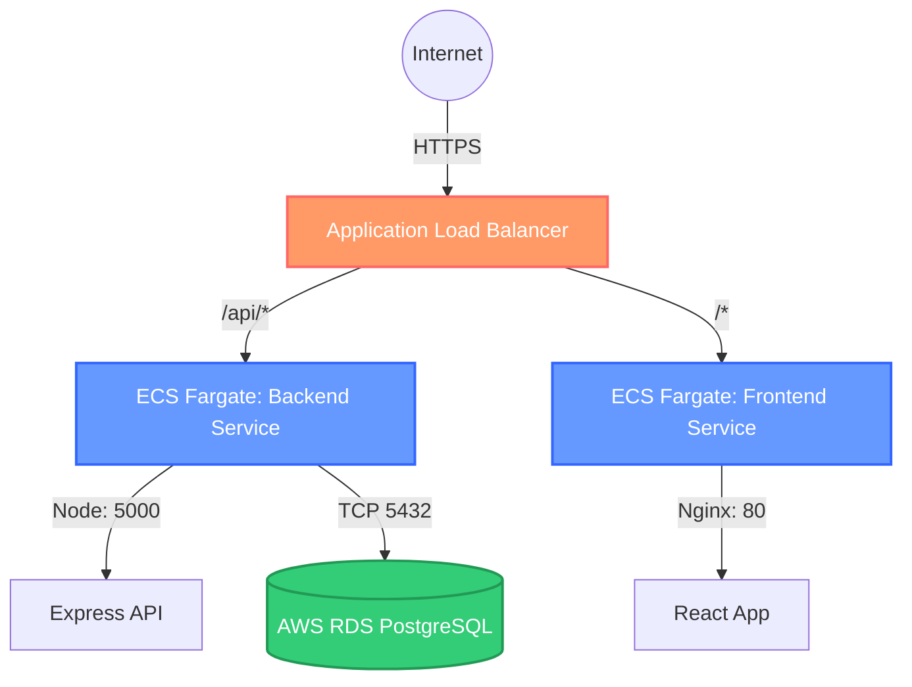

# TaskFlow — 3-Tier Task Manager

A production-ready Task Management SaaS application built for **AWS ECS Fargate** deployment utilizing a fully automated 3-tier cloud architecture.

**Stack:** React + Vite + TailwindCSS | Node.js + Express | PostgreSQL (AWS RDS)

---

## 🏗️ Architecture



- **Frontend:** React application served by Nginx securely within an ECS container.
- **Backend:** Node.js Express REST API connected to an RDS Database instance.
- **ALB (Application Load Balancer):** Manages internet traffic and implements **Path-Based Routing** directly to the respective Fargate containers.
- **Database:** Managed Amazon RDS PostgreSQL database residing securely in AWS VPC subnets.

---

## 🚀 Fully Automated AWS Deployment (`deploy.py`)

This project features a powerful, single-command Python deployment engine using `boto3`. 

The `deploy.py` script provisions, configures, and bootstraps the entire cloud infrastructure from scratch. It is completely **idempotent**, meaning you can run it multiple times safely. 

**What `deploy.py` automates:**
1. **Networking:** Creates a VPC, Subnets, Internet Gateway, and Route Tables.
2. **Security:** Provisions strict Security Groups for ALB, ECS, and RDS.
3. **Registry:** Creates Elastic Container Registry (ECR) repositories.
4. **Containerization:** Builds the React and Node.js Docker images and pushes them to ECR.
5. **Database Provisioning:** Spins up a protected Amazon RDS PostgreSQL instance.
6. **Schema Migration:** Connects to the new RDS instance and automatically runs `schema.sql` to initialize tables.
7. **Load Balancing:** Creates an ALB with target groups and path-based routing (`/api*` goes to backend, `/` goes to frontend).
8. **Monitoring & Logging:** Automatically enables CloudWatch Metrics scraping via ECS Container Insights and CloudWatch Log Group Metric Filters for capturing `ERROR` and `FATAL` events.
9. **Compute:** Deploys resilient AWS Fargate Tasks and Services.
10. **Verification:** Waits for high availability, performs health checks, and returns your live public URLs.

### How to Deploy

1. Ensure **Python** and **Docker** are installed and running locally.
2. Ensure you have the required Python packages:
   ```bash
   pip install boto3 pg8000 requests
   ```
3. Run the automated deployment script:
   ```bash
   python deploy.py --enable-rds
   ```
4. The console will prompt you to enter your **AWS Access Key**, **Secret Key**, and **Region**.
5. Grab a coffee! The script will stream your architecture to life and provide the live website URL upon completion.

### Tearing Down Infrastructure

To immediately destroy all generated AWS resources (DB schemas, ECR repos, ECS clusters, ALB config) to avoid idle costs, simply execute:
```bash
python deploy.py --destroy
```

---

## 💻 Local Development (Docker Compose)

You can run the full 3-tier stack locally on your computer with a single command:

```bash
# 1. Copy local environment files
cp backend/.env.example backend/.env
cp frontend/.env.example frontend/.env

# 2. Build and launch containers
docker compose up --build

# 3. Access locally:
#   Frontend → http://localhost:3000
#   Backend  → http://localhost:5000
#   Database → localhost:5432
```

---

## 📜 API Reference

| Method | Endpoint              | Body / Query                      | Auth required? |
|--------|-----------------------|-----------------------------------|----------------|
| POST   | `/api/auth/register`  | `{name, email, password}`         | No             |
| POST   | `/api/auth/login`     | `{email, password}`               | No             |
| GET    | `/api/auth/me`        | *None*                            | Yes            |
| GET    | `/api/tasks`          | `?status=pending\|completed`      | Yes            |
| POST   | `/api/tasks`          | `{title, description?}`           | Yes            |
| PUT    | `/api/tasks/:id`      | `{title?, description?, status?}` | Yes            |
| DELETE | `/api/tasks/:id`      | *None*                            | Yes            |

*(JWT tokens are required for authenticated routes and must be passed as `Authorization: Bearer <token>`)*

---

### Project Structure

```
3-tier-task-app/
├── deploy.py                  # End-to-End Infrastructure Deployment execution script
├── frontend/                  # React Vite Application & Nginx configurations
├── backend/                   # Node.js Express REST API 
├── database/                  
│   └── schema.sql             # SQL Initializers (Auto-applied by deploy.py)
├── docker-compose.yml         # Local orchestration
└── requirements.txt           # Deployment Python dependencies
```
